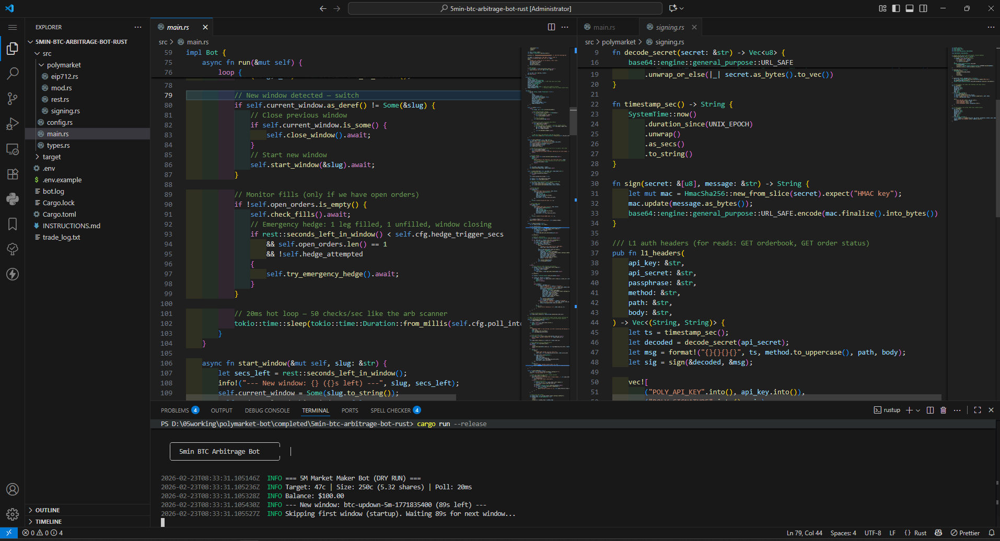
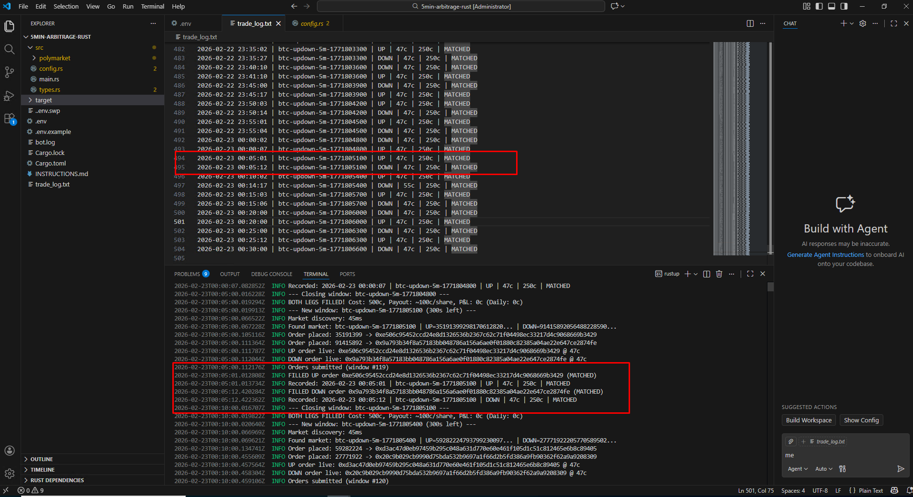
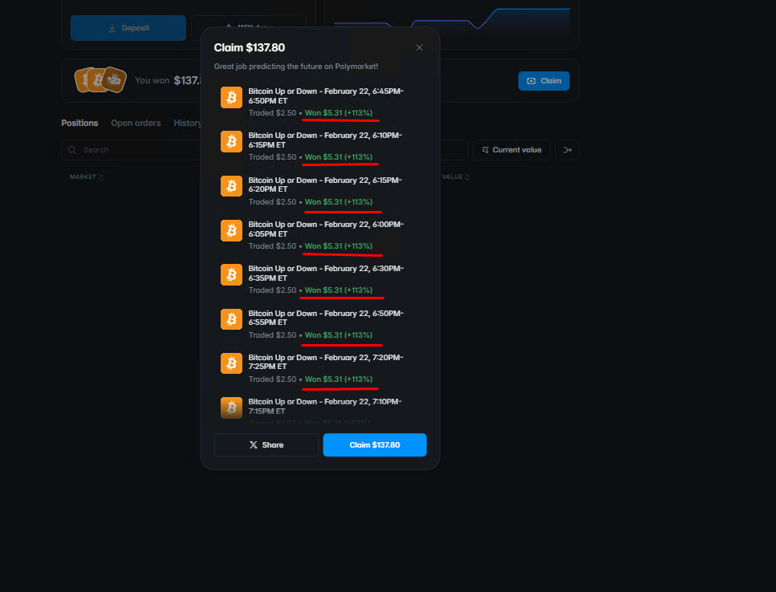
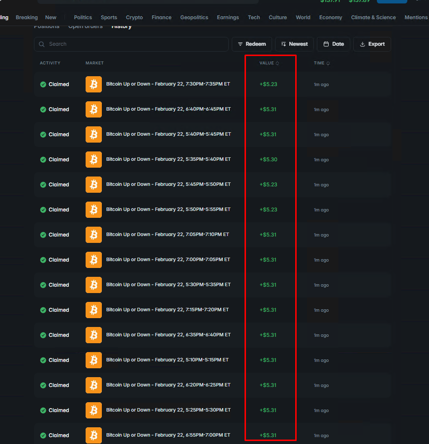

# Polymarket 5min 15min BTC Arbitrage Bot | High-Speed Prediction Market Trading

**Contact: Telegram [@movez_x](https://t.me/movez_x)**

**中文 | [README 中文版](README_CN.md)**

---

## What is This Bot?

A high-performance **Polymarket 5-minute BTC Up/Down arbitrage bot** that places orders within **20ms** - giving you a speed edge in prediction market trading. Built with **Rust** for maximum reliability and low latency.

The bot automatically trades Polymarket's 5-minute Bitcoin price windows. It places both UP and DOWN limit orders concurrently at market-neutral prices, capturing arbitrage when both legs fill. You can see real trade history in the screenshots below.

---

## Screenshots

| Bot Running |
|-------------|
|  |

| Trade Log |
|-----------|
|  |

| Order Fill | Success History |
|------------|-----------------|
|  |  |

| Daily P&L |
|-----------|
|  |

*Real trade history shown above — all screenshots are from actual bot runs.*

---

## 5 Advantages for Traders

1. **Ultra-fast execution** — Orders placed within 20ms (50 checks/sec). Beat manual traders and slower bots.

2. **Passive income** — Run 24/7. Set it and forget it. The bot captures arbitrage opportunities automatically.

3. **Market-neutral strategy** — Buys both UP and DOWN tokens. Profit regardless of whether BTC goes up or down.

4. **Real trade history** — See actual trades in the screenshots above. Full transparency and verifiable results.

5. **Built with Rust** — High performance, low latency, reliable execution. No crashes or memory leaks.

---

## Feature Requests, Help & Premium

Want to add a feature, need help, or get premium support? Contact via **Telegram: [@movez_x](https://t.me/movez_x)**

If you want to increase features for the 5min/15min/1hr bot or add XRP, SOL, ETH bots, contact via **Telegram: [@movez_x](https://t.me/movez_x)**

---

## How to Run

### Prerequisites

- [Rust](https://rustup.rs/) installed
- Polymarket API credentials

### Setup

1. Copy the config:
   ```bash
   cp .env.example .env
   ```

2. Edit `.env` and add your keys:
   - `POLYGON_PRIVATE_KEY`
   - `POLYMARKET_FUNDER`
   - `CLOB_API_KEY`, `CLOB_API_SECRET`, `CLOB_API_PASSPHRASE`

3. Test dry run first:
   ```bash
   DRY_RUN=true cargo run --release
   ```

4. Run live:
   ```bash
   DRY_RUN=false cargo run --release
   ```

---

## Contact

**Telegram: [@movez_x](https://t.me/movez_x)**

