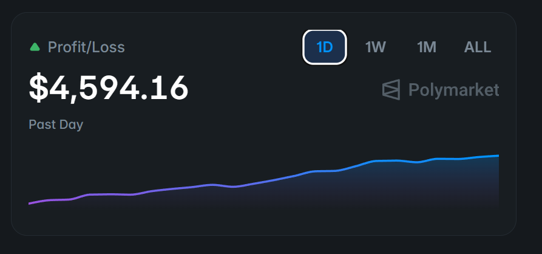

# Polymarket 5分钟 15分钟 BTC 套利机器人 | 高速预测市场交易

**联系方式：Telegram [@movez_x](https://t.me/movez_x)**

**English | [README (English)](README.md)**

---

## 这是什么机器人？

一款高性能 **Polymarket 5分钟 BTC 涨跌套利机器人**，在 **20毫秒内** 完成下单，为你在预测市场交易中提供速度优势。使用 **Rust** 开发，保证高可靠性和低延迟。

机器人自动交易 Polymarket 的 5 分钟比特币价格窗口。它同时挂出 UP 和 DOWN 限价单，以市场中性价格捕获套利机会。下方截图可查看真实交易记录。

---

## 截图

| 机器人运行 |
|-----------|
|  |

| 交易日志 |
|---------|
|  |

| 订单成交 | 成功记录 |
|----------|----------|
|  |  |

| 每日盈亏 |
|---------|
|  |

*以上为真实交易记录 — 所有截图均来自实际运行。*

---

## 5 大交易优势

1. **极速执行** — 20毫秒内下单（每秒50次检查）。超越手动交易和慢速机器人。

2. **被动收入** — 24/7 运行。设置好后无需盯盘，自动捕获套利机会。

3. **市场中性策略** — 同时买入 UP 和 DOWN 代币。无论 BTC 涨跌都能盈利。

4. **真实交易记录** — 上方截图展示实际交易。完全透明，可验证结果。

5. **Rust 开发** — 高性能、低延迟、稳定运行。无崩溃、无内存泄漏。

---

## 功能定制、帮助与高级版

需要添加功能、获取帮助或购买高级版？请通过 **Telegram: [@movez_x](https://t.me/movez_x)** 联系。

如需扩展 5分钟/15分钟/1小时 机器人功能，或添加 XRP、SOL、ETH 机器人，请通过 **Telegram: [@movez_x](https://t.me/movez_x)** 联系。

---

## 如何运行

### 环境要求

- 已安装 [Rust](https://rustup.rs/)
- Polymarket API 凭证

### 配置步骤

1. 复制配置文件：
   ```bash
   cp .env.example .env
   ```

2. 编辑 `.env` 并填入你的密钥：
   - `POLYGON_PRIVATE_KEY`
   - `POLYMARKET_FUNDER`
   - `CLOB_API_KEY`、`CLOB_API_SECRET`、`CLOB_API_PASSPHRASE`

3. 先进行模拟测试：
   ```bash
   DRY_RUN=true cargo run --release
   ```

4. 正式运行：
   ```bash
   DRY_RUN=false cargo run --release
   ```

---

## 联系方式

**Telegram: [@movez_x](https://t.me/movez_x)**

